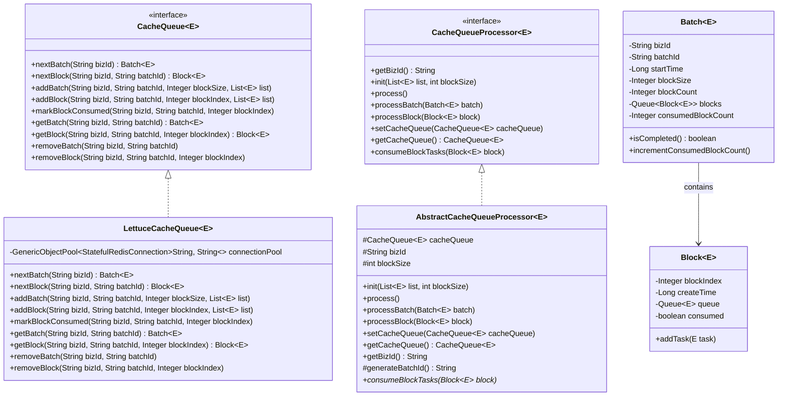

# CFF Cache Queue Spring Boot Starter

这是一个基于Redis缓存的分布式主子队列框架，使用Spring Boot和Lettuce实现，并封装成一个spring-boot-starter。

## 功能特性

- 按照不同业务模块和批次创建主任务(Batch)，每个主任务批次包含一个Block子任务队列
- 每个批次下按照配置的blockSize大小将任务列表拆分为多个不同的任务Block，每个任务Block拥有一个拆分后的小任务队列
- 任务处理器负责生产任务和消费任务，自动读取当前主任务批次的消费进度，保证任务不丢失也不重复消费
- 使用Redis连接池提高性能和资源利用率
- 支持通过配置文件自定义连接池参数

## 核心组件

### 1. CacheQueue接口
缓存队列的抽象，负责与redis缓存进行交互。

### 2. LettuceCacheQueue
基于Lettuce的CacheQueue实现类，使用连接池管理Redis连接。

### 3. CacheQueueProcessor接口
任务处理器的抽象，具有生产和消费任务的能力。

### 4. AbstractCacheQueueProcessor
CacheQueueProcessor的抽象类，封装了生产任务队列和消费的模板方法。

### 5. 数据模型
- Batch: 主任务批次
- Block: 子任务块

## 使用方法

### 1. 添加依赖

在你的Spring Boot项目中添加以下依赖：

```xml
<dependency>
    <groupId>com.cff</groupId>
    <artifactId>cff-cache-queue-spring-boot-starter</artifactId>
    <version>1.0.0-SNAPSHOT</version>
</dependency>
```

### 2. 配置文件

在application.yml中添加以下配置：

```yaml
cff:
  cache:
    queue:
      config:
        host: localhost
        port: 6379
        password: your_password # 如果没有密码可以不配置
        # 连接池配置
        pool:
          maxTotal: 20          # 最大连接数
          maxIdle: 10           # 最大空闲连接数
          minIdle: 2            # 最小空闲连接数
          maxWaitMillis: 2000   # 获取连接的最大等待时间（毫秒）
      biz:
        - bizId: your_biz_id
          blockSize: 100
```

### 3. 创建自定义处理器

创建一个自定义的处理器类继承AbstractCacheQueueProcessor：

```java
@Component
public class YourCacheQueueProcessor extends AbstractCacheQueueProcessor<YourTaskType> {
    
    public YourCacheQueueProcessor() {
        setBizId("your_biz_id");
    }
    
    @Override
    public void consumeBlockTasks(Block<YourTaskType> block) {
        Queue<YourTaskType> taskQueue = block.getQueue();
        // 实现你的任务消费逻辑
    }
}
```

### 4. 使用处理器

在你的服务中注入并使用处理器：

```java
@Service
public class YourService {
    
    @Autowired
    private YourCacheQueueProcessor processor;
    
    @Autowired
    private CacheQueue<YourTaskType> cacheQueue;
    
    public void processTasks(List<YourTaskType> tasks) {
        processor.setCacheQueue(cacheQueue);
        processor.init(tasks, 100); // 100为块大小
        processor.process();
    }
}
```

## 架构设计

### 主要类关系图



## Redis数据结构

### 键命名规范

- 批次队列: `cache_queue:{bizId}:batches`
- 批次信息: `cache_queue:{bizId}:batch:{batchId}:info`
- 块队列: `cache_queue:{bizId}:batch:{batchId}:blocks`
- 块信息: `cache_queue:{bizId}:batch:{batchId}:block:{blockIndex}:info`
- 块数据: `cache_queue:{bizId}:batch:{batchId}:block:{blockIndex}:data`

## 连接池配置

框架使用Lettuce的连接池功能来管理Redis连接，以提高性能和资源利用率。连接池的配置可以通过Spring Boot的Redis配置进行调整：

```yaml
cff:
  cache:
    queue:
      config:
        pool:
          maxTotal: 20          # 最大连接数
          maxIdle: 10           # 最大空闲连接数
          minIdle: 2            # 最小空闲连接数
          maxWaitMillis: 2000   # 获取连接的最大等待时间（毫秒）
```

连接池配置参数说明：
- `maxTotal`: 最大连接数，控制连接池中最多可以有多少个连接
- `maxIdle`: 最大空闲连接数，控制连接池中最多可以有多少个空闲连接
- `minIdle`: 最小空闲连接数，控制连接池中最少需要保持多少个空闲连接
- `maxWaitMillis`: 获取连接的最大等待时间，当连接池中没有可用连接时，等待获取连接的最大时间

## 贡献

欢迎提交Issue和Pull Request来改进这个项目。